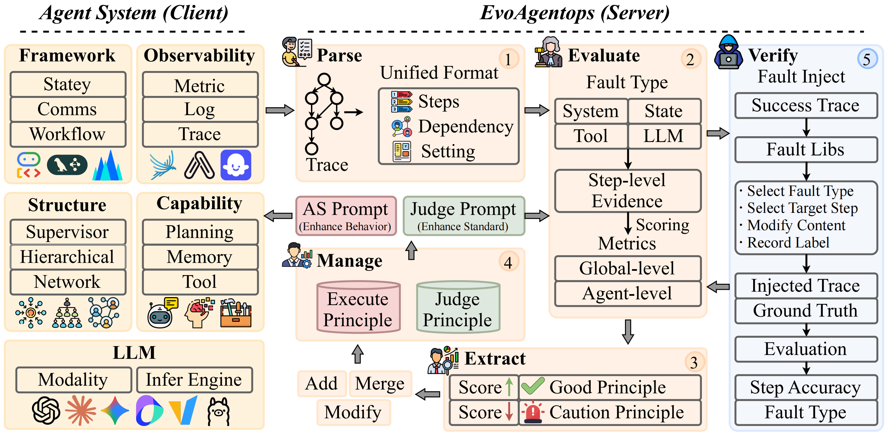

# EvoAgentOps: Self-Evolving Agent Evaluation and Optimization via Principle Learning

This repository provides the official implementation of **EvoAgentOps**, a novel framework for agent system evaluation and optimization through bidirectional self-evolution. Our work addresses the critical limitations in current agent evaluation methods, enabling step-level fault localization, interpretable evaluation, and co-evolution of both agent systems and judges.

## 📖 Introduction

Agent systems are transforming enterprise workflows, with industry reports predicting that they will handle 15% of enterprise decisions by 2028 and reach a $52.6 billion market by 2030. However, current evaluation methods face three fundamental challenges:

1. **C1: Evaluation Lacks Interpretability** - Existing judges output scores without step-level fault localization
2. **C2: Evaluation Lacks Feedback Loop** - Agent behavior evolves but judge criteria remain fixed
3. **C3: Evaluation Lacks Verification** - Fault localization accuracy cannot be validated without ground truth

EvoAgentOps addresses these challenges through:
- **Evidence-based Evaluation** with hierarchical fault taxonomy (4 layers, 26 types) and binary check criteria
- **Bidirectional Self-Evolution** enabling co-evolution of both agent systems and judges
- **Automatic Judge Verification** via fault injection into successful traces



## 🏗️ Project Structure

```bash
.
├── README.md                          
├── pyproject.toml                     # Python project configuration
├── agent_system/                      # Agent system implementations
│   ├── AutoGen_GSM8K/                 
│   └── LangGraph_Spider/            
├── evoagentops/                       # Core framework package
├── scripts/                           # Execution and evaluation scripts
│   ├── .env                           # Environment configuration
│   └── ...                             
└── results/                         
```

## 🚀 Quick Start

1. **Environment Setup**
```bash
cd evoagentops
uv sync
source .venv/bin/activate
```

2. **Environment Configuration**
Create `scripts/.env` with your LLM API credentials:
```bash
MODEL_PROVIDER="openai"
OPENAI_MODEL=""
OPENAI_BASE_URL=""
OPENAI_API_KEY=""

EMBEDDING_MODEL=""
EMBEDDING_BASE_URL=""
EMBEDDING_API_KEY=""
```

3. **Basic Usage**

```bash
cd scripts
# Agent Execution with Principles
python 02_5_execute_principle.py

# Generate Fault Injected Dataset
python 03_test_faultinjection.py

# Judge evaluation with principles
python 04_judge_principle.py
```

## 🔬 Core Components

### 1. **Unified Trace Parsing**
Converts heterogeneous traces from different frameworks (ADK, AutoGen, LangGraph) into a standard format for cross-framework evaluation.

### 2. **Hierarchical Fault Taxonomy**
4-layer taxonomy with 26 fault types:
- **LLM Inference Layer** (F01-F14): Content errors, constraint violations, format issues
- **Tool Execution Layer** (F15-F19): Tool invocation and parameter errors
- **State Management Layer** (F20-F24): Memory and trajectory issues
- **Coordination Layer** (F25-F26): Multi-agent collaboration faults

### 3. **Principle Management**
- **Execution Principles**: Optimize agent behavior
- **Judge Principles**: Refine evaluation standards
- **Principle Bank**: Stores and manages principles with operations (add, modify, merge)

### 4. **Fault Injection Verification**
Injects known faults into successful traces to create labeled test data with ground truth for quantitative verification.

## 🎯 Key Results

Our evaluation shows:
- **Up to 90% step-level accuracy** with joint evaluation (baselines < 35%)
- **75% improvement in Pass@1** with execution principle augmentation
- **Over 60% compression rate** in principle management while preserving knowledge

